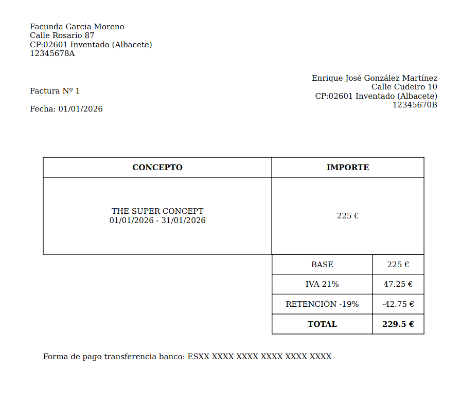

# Invoice Generator

A lightweight command-line invoice PDF generator using JSON data entries and Jinja2 HTML templates.

## 🧩 Project Overview

This project generates a set of customer invoices from a data reference JSON file (`data_refs/*.json`) and an HTML template (`template/*.jinja.html`).

- Reads `data_refs/<data-ref-file>`
- Creates monthly invoice data (April–December) based on `INVOICE_YEAR`, `INVOICE_BASE`, taxes, retentions, etc.
- Renders HTML with Jinja2
- Generates PDF via WeasyPrint in `invoices/`

## 📋 Prerequisites

- Python 3.13+
- `uv` dependency manager

## ⚙️ Install

1. Install `uv` globally:

```bash
python -m pip install --upgrade pip
python -m pip install uv
```

2. Install project dependencies with `uv`:

```bash
uv install jinja2 weasyprint
```

3. Optionally use `pyproject.toml`:

```bash
uv install
```

## 🚀 Execution

### Run with `uv`

```bash
uv run python main.py
```

### Run with custom files

```bash
uv run python main.py --data-ref-file rd_local.json --template-file spanish.jinja.html
```

### Start month option

```bash
uv run python main.py --start-month 6
```

You can generate invoices starting from any month until December, instead of the default April.

```bash
python main.py --start-month 6
```

This runs generation for June through December (months 6..12).

> Since you requested `uv` as dependency manager, this project does not require an API server by default.

## 📁 File structure

- `main.py` - invoice generation logic
- `pyproject.toml` - project metadata
- `data_refs/` - JSON input references
- `template/` - Jinja HTML template(s)
- `invoices/` - generated output PDFs

## 🖼️ Example generated PDF preview

A typical generated invoice contains:

- header with customer name and invoice number
- invoice issue date and period
- concept details (for example: `HomerSimpsons` service description)
- base amount, IVA (tax), retention, total amount
- footer with company/contact details

Your project includes `invoices/HomerSimpsons.pdf` and `invoice_example.png`.




## 🧑‍🎨 Customization

- Edit data in `data_refs/data.example.json`
- Edit templates in `template/spanish.jinja.html`
- Change start month default in `main.py` (current `4` for April) and `--start-month` argument usage

## ✅ Notes

- `uv` is the dependency manager used in `pyproject.toml` (not an ASGI server).
- The script works out of the box with `python main.py`.

